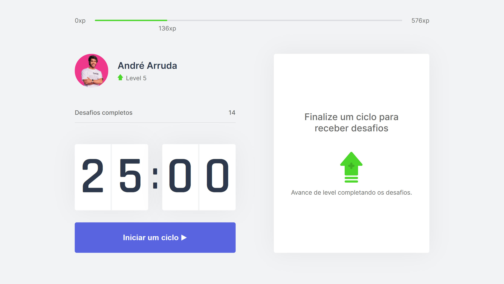
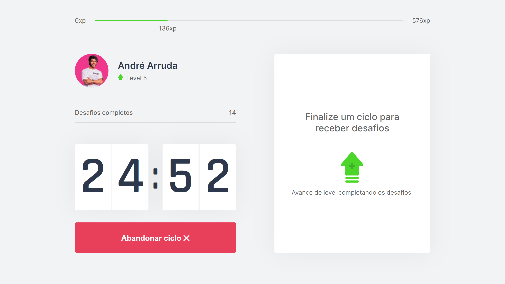
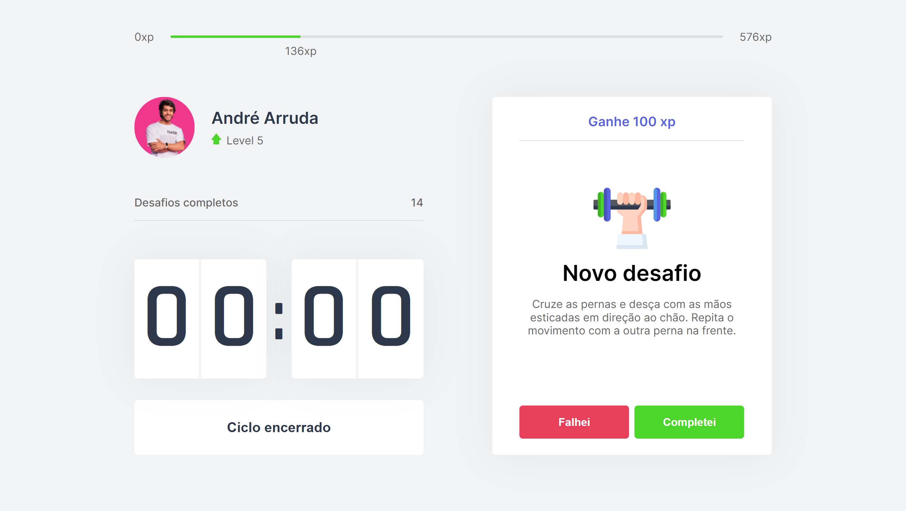

<h1 align="center">
    
</h1>

<h4 align="center">
  🚀 Next Level 4 - Move.it
</h4>


<p align="center">
  <a href="#-tecnologias">Tecnologias</a>&nbsp;&nbsp;&nbsp;|&nbsp;&nbsp;&nbsp;
  <a href="#-projeto">Projeto</a>&nbsp;&nbsp;&nbsp;|&nbsp;&nbsp;&nbsp;
  <a href="#instalação">Instalação</a>&nbsp;&nbsp;&nbsp;|&nbsp;&nbsp;&nbsp;
  <a href="#telas">Telas</a>&nbsp;&nbsp;&nbsp;|&nbsp;&nbsp;&nbsp;
  <a href="#exemplo">Exemplo</a>
</p>

## 🚀 Tecnologias

Esse projeto foi desenvolvido com as seguintes tecnologias:

- [Next.js](https://nextjs.org/)

## 💻 Projeto
**Move.it é uma aplicação para baseada na técnica Pomodoro para te ajudar de forma divertida a se exercitar depois de um longo tempo na frente do PC**

## Instalação
### Pré requisitos
Ter instalado:
- [Node](https://nodejs.org/en/download/)
- [Yarn](https://classic.yarnpkg.com/en/docs/install/)

### Clonar projeto
#### No terminal, rodar
```sh
git clone https://github.com/andre23arruda/moveit

# Entrar na pasta do projeto
cd moveit

# Instalar os pacotes necessários
yarn install

# Rodar
yarn dev
```

## Telas
<div align="center">
    
</div>
<p align="center">Screen 1</p>
<hr>

<div align="center">
    
</div>
<p align="center">Screen 2</p>
<hr>

<div align="center">
    
</div>
<p align="center">Screen 3</p>
<hr>

## Exemplo
<a href="https://andrearruda-moveit.vercel.app" target="_blank">Visitar</a>